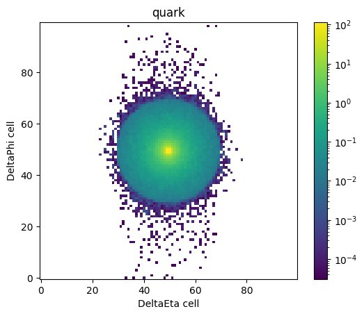
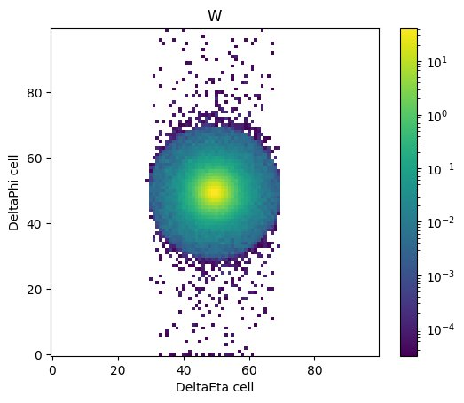
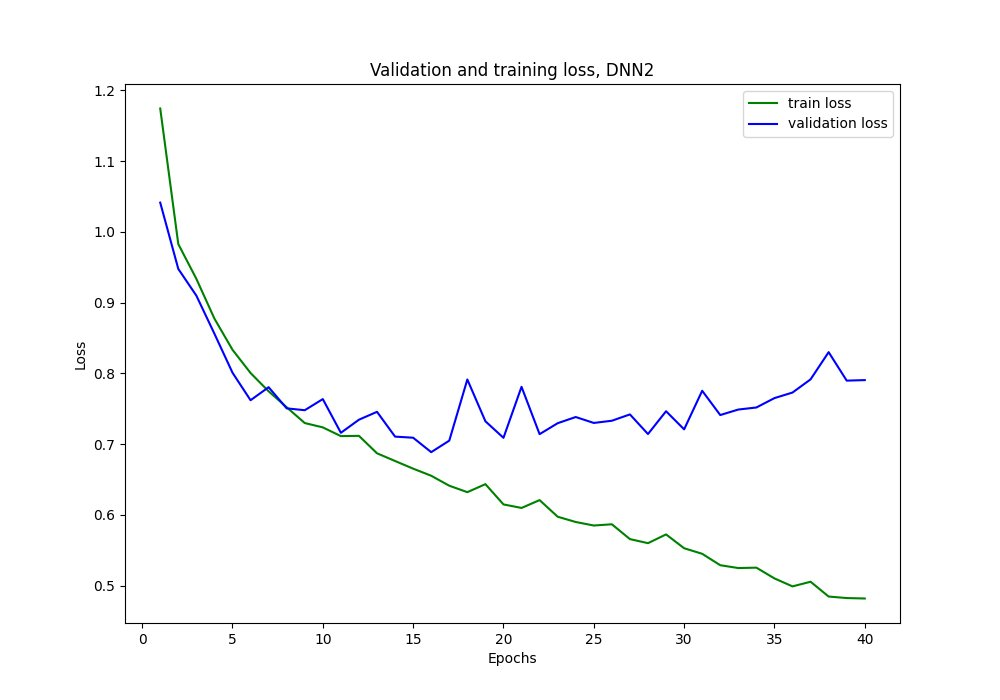
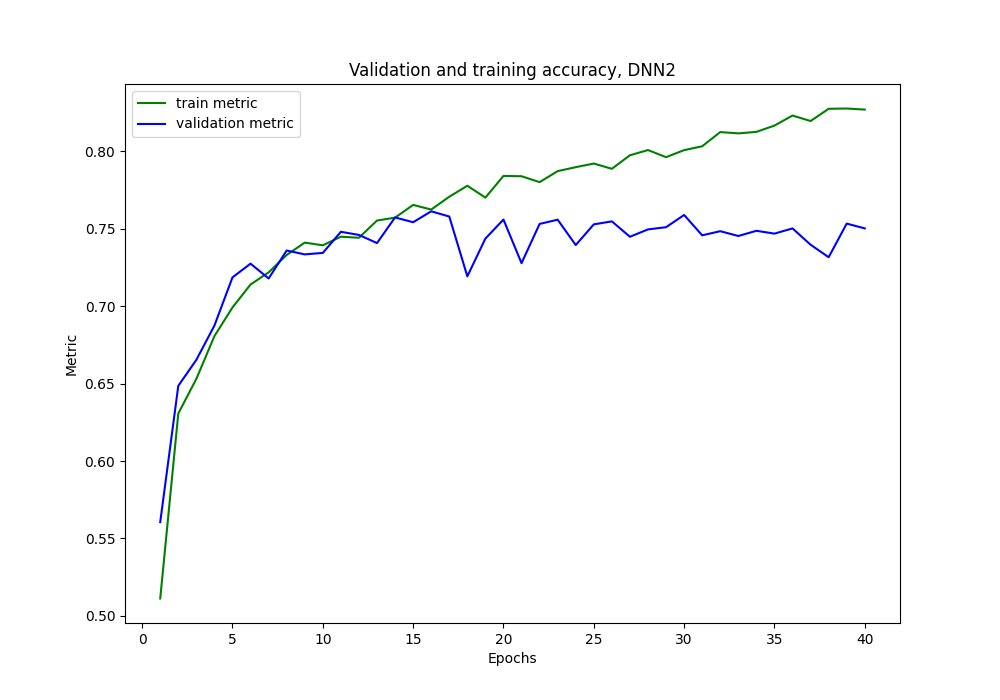
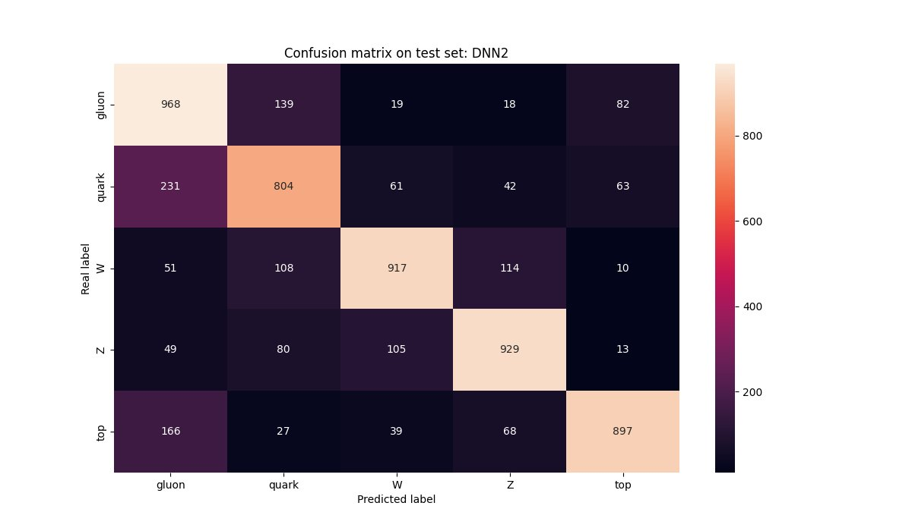

# Jet Tagging with Deep Neural Networks

*Classifying hadronic jets from LHC collision data using CNNs and locally connected networks in PyTorch*

Final project for the course **Artificial Intelligence and Machine Learning Methods for Physics** at **Sapienza University of Rome**, completed in collaboration with **Ariana Ojanen**. The course and written report were conducted in Italian.

---

## Overview

At the Large Hadron Collider (LHC), highly energetic particle collisions produce **hadronic jets** — collimated sprays of particles resulting from the decay of heavier particles. Determining which particle originally produced a given jet is a core problem in experimental high-energy physics, known as **jet tagging**.

This project implements and compares five deep neural network architectures in PyTorch to classify jets into five categories: gluon, quark, W boson, Z boson, and top quark. The input data is treated as images — 2D histograms of momentum deposited across a 100×100 detector grid centred on the jet axis.

The project is inspired by and benchmarked against the work of [Baldi et al. (2016)](https://link.aps.org/doi/10.1103/PhysRevD.93.094034).

---

## Dataset

The dataset consists of **80,000 jet images** stored in HDF5 format, each a 100×100 2D histogram of transverse momentum deposits. Each image is labelled with a one-hot encoding indicating the originating particle:

| Label | Particle |
|---|---|
| `[1,0,0,0,0]` | Gluon |
| `[0,1,0,0,0]` | Quark |
| `[0,0,1,0,0]` | W boson (W → qq̄) |
| `[0,0,0,1,0]` | Z boson (Z → qq̄) |
| `[0,0,0,0,1]` | Top quark (t → Wb → qq̄b) |

The images below show the average momentum deposit over 40,000 jets for two classes. The subtle structural differences between them — a quark jet is slightly more spread, a W jet slightly more elongated — are exactly what the networks learn to distinguish.

| Quark jets (averaged) | W boson jets (averaged) |
|---|---|
|  |  |

Due to memory constraints on Google Colab, 30,000 images were used, split 60/20/20 into training, validation, and test sets. All inputs were normalised to zero mean and unit standard deviation before training.

---

## Models

Five architectures were implemented and compared, progressively increasing in complexity:

**DNN0** — Baseline: two fully connected linear layers with ReLU activation.

**DNN1** — Four fully connected layers with ReLU activations and 0.2 dropout per layer.

**DNN2** — CNN: three convolutional layers (4×4 kernels) with max pooling, followed by four fully connected layers with ReLU and dropout. *Best performing model.*

**DNN3** — Deeper CNN: four convolutional layers with mixed max pooling, followed by four fully connected layers using tanh activations and mixed dropout rates.

**DNN4** — Hybrid: a custom **locally connected layer** (implemented from scratch) followed by two convolutional layers and four fully connected layers. Unlike a standard CNN, the locally connected layer learns independent weights for each spatial region without assuming translational invariance.

A shared training loop handles epoch iteration, backpropagation, validation, automatic model checkpointing (best validation accuracy), and CSV logging of training history.

---

## Results

| Model | Architecture | Test Accuracy |
|---|---|---|
| DNN0 | 2-layer linear | 0.626 |
| DNN1 | 4-layer linear | 0.644 |
| DNN2 | CNN + linear | **0.753** |
| DNN3 | Deeper CNN + linear | 0.736 |
| DNN4 | Locally connected + CNN + linear | 0.734 |

**DNN2** achieved the best test accuracy of **75.3%** on the 5-class classification task. The training curves below show the characteristic overfitting pattern — validation accuracy plateaus around epoch 10 while training accuracy continues to climb — which was observed across all CNN-based models.

| Training loss | Training accuracy |
|---|---|
|  |  |

The confusion matrix confirms strong performance on top quarks and gluons, with the most confusion occurring between W and Z bosons — physically expected, as their jet substructure is very similar.



The purely linear models (DNN0, DNN1) performed significantly worse, as they discard all spatial structure in the images. The gap relative to Baldi et al. is expected: their model used 10 million training images versus our 30,000, and included dedicated image preprocessing not within the scope of this project.

---

## Example Usage

```python
# Instantiate and train the best-performing model
model2 = DNN2().to(device)
run_model(model2, epochs=40)

# Evaluate on test set and plot confusion matrix
run_on_test(DNN2())
```

---

## Dependencies

- **PyTorch** — model definition, training, GPU support
- **torchmetrics** — multiclass accuracy evaluation
- **h5py** — HDF5 dataset loading
- **scikit-learn** — train/test splitting, confusion matrix
- **seaborn / matplotlib** — visualisation
- **Google Colab** — GPU-accelerated training

---

## References

- Baldi, P. et al. — *Jet substructure classification in high-energy physics with deep neural networks*, Phys. Rev. D 93, 094034 (2016)
